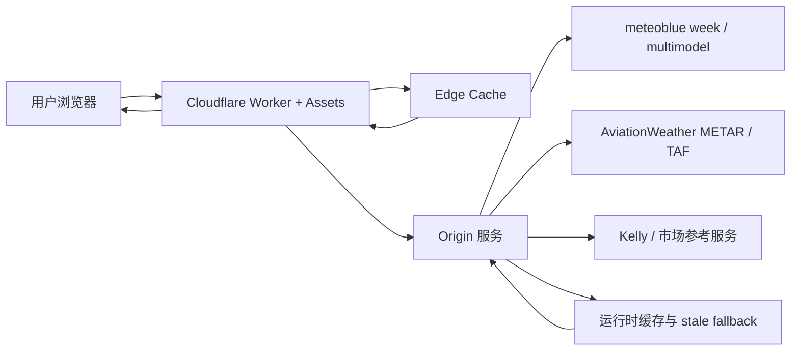

# 全球机场高温天气决策台

[](https://workers.cloudflare.com/)
[](https://react.dev/)
[](https://www.typescriptlang.org/)
[](https://vite.dev/)
[](https://vitest.dev/)

面向全球机场高温风险、小时级天气和市场信号的实时决策工作台。系统把 meteoblue 多模型、官方天气图、航空 METAR/TAF、Kelly 概率和市场参考聚合在一个高信息密度界面里，让用户快速判断：哪个机场正在升温、哪个时段最关键、哪些模型分歧最大、当前数据是否可靠。

生产环境入口：[https://lukaluka.fun](https://lukaluka.fun)

> 当前重点：稳定 Cloudflare 线上多模型分析。最新版本已经覆盖快速切换城市、冷/热缓存、超时中断、origin 代理和前端可解释加载态。

## 一眼看懂

| 模块 | 用户价值 | 当前状态 |
| --- | --- | --- |
| 全球机场天气首页 | 查看当前温度、24 小时轨道、高温峰值、天气摘要和航空报文 | 可用 |
| 多模型分析 | 读取 meteoblue multimodel Highcharts 数据，展示模型排名、温度分布和峰值时段 | 重点加固中 |
| 官方多模型原图 | 转发 meteoblue 官方 multimodel 图片，保留可核对来源 | 可用 |
| Kelly 工作台 | 把天气信号、市场参考、机会面板和风险模式放在同一工作流 | 可用 |
| 移动端快切 | 触屏地点选择、收藏、分组浏览和分析页移动视图 | 可用 |
| Cloudflare 线上验证 | 真实域名下的 direct / switch / burst / click-burst 回归脚本 | 已接入 |

## 产品亮点

- **用户无感的多模型加载**：Insight 先显示，Distribution 后补齐；抓取慢时保留可展示缓存；失败时明确区分加载中、缓存兜底、origin 不可用和数据缺失。
- **快速城市切换不串数据**：前端使用 request epoch、AbortController、location guard 和 batch key，避免旧城市请求晚返回后覆盖新城市。
- **Cloudflare 边缘轻量化**：Worker 负责路由、缓存和代理；长耗时的多模型抓取优先交给 origin，降低 Worker 1102 资源限制风险。
- **高信号源状态展示**：数据源卡片表达“用户现在能不能读到数据”，不把内部刷新、回退或诊断状态直接暴露成主体验。
- **航空天气上下文**：METAR / TAF 摘要、METAR Reader 外链和机场级报文状态帮助用户核对真实天气。
- **桌面和移动双工作流**：桌面保留高密度排序、sticky 资料栏和完整模型面板；移动端提供单手切换和触屏列表。

## 系统架构



## 核心页面

### 首页

- 当前机场温度、高温峰值、24 小时温度轨道和中文天气摘要。
- 航空报文摘要、METAR Reader 外链和数据源状态。
- 收藏城市、最近城市和分组地点切换。

### 多模型分析

- meteoblue multimodel 模型排名、当前温度偏差、日内峰值温度和峰值时间。
- 当前温度分布、日内最高温分布、峰值命中模型集合。
- 官方原图查看、模型资料侧栏和多模型 source proof。
- 快速城市切换场景下支持缓存兜底、请求取消和晚返回防护。

### Kelly 工作台

- 按机场、目标日期、资金、风险模式和实际温度参数生成机会面板。
- 结合天气信号、市场参考、盘口状态和流式更新。
- 支持 origin 代理、WebSocket 路径和本地 fallback。

## 最近版本

完整版本历史见 [CHANGELOG.md](./CHANGELOG.md)。

| 版本 | 主题 | 关键变化 |
| --- | --- | --- |
| v0.1.12 | 多模型加载 UX 稳定 | 避免整页 skeleton 误遮住分析区；新增 Cloudflare render timing / click-burst 测试脚本 |
| v0.1.11 | 多模型稳定性硬化 | timeout 触发真实 abort；收紧 `MULTIMODEL_ORIGIN_UNAVAILABLE` 重试；修复 origin skew circuit 风险 |
| v0.1.10 | 多模型 origin 代理 | Cloudflare Worker 不再承担重型 multimodel 抓取，改由 origin 处理并暴露健康字段 |
| v0.1.7 | Distribution 延迟加载 | Insight 成功后再加载 distribution，减少快速切城时前台压力 |
| v0.1.6 | 渐进式多模型渲染 | Insight 先可见，distribution 失败不再清空整个分析工作区 |
| v0.1.5 | 前台缓存优先级 | 冷启动前台请求可以越过后台 refresh，避免用户等待后台任务 |

## 技术栈

| 层级 | 技术 |
| --- | --- |
| 前端 | React 19, Vite 6, Tailwind CSS 4, Radix UI, lucide-react, motion |
| 后端 | Node.js 22+, TypeScript, Fastify 5, ESM, Cheerio |
| 实时路径 | WebSocket, Kelly stream proxy, origin fallback |
| Cloudflare | Workers, Assets, edge cache, wrangler, custom domain |
| 测试 | Vitest, TypeScript compile check, Playwright online regression, encoding guard |
| 数据处理 | meteoblue Highcharts payload, week meteogram, METAR/TAF, Kelly market reference |

## 数据源

- meteoblue week 页面：小时级天气、中文天气报告和 meteogram 补充数据。
- meteoblue multimodel 页面：官方原图转发与公开 `format=highcharts` payload 解析。
- AviationWeather：默认 METAR / TAF 数据源。
- METAR Reader：外部详情站点，本项目只生成机场 ICAO 链接。
- Kelly origin：市场参考、机会面板、流式更新和生产代理路径。

## 快速开始

环境要求：

- Node.js 22+
- npm 或 pnpm
- Cloudflare 部署需要本地 wrangler 凭据

```bash
npm install
npm --prefix zip install
copy .env.example .env
npm run dev
```

前端单独开发：

```bash
npm run dev:web
```

Cloudflare Worker 本地调试：

```bash
npm run build
npm run dev:cloudflare
```

## 常用命令

```bash
npm run build
npm run check
npm test
```

线上多模型快速切换验证：

```bash
node tools/measure-multimodel-render-timing.mjs --baseUrl=https://lukaluka.fun --mode=click-burst --burstSize=9 --intervalMs=50 --rowTimeoutMs=24000
node tools/measure-multimodel-render-timing.mjs --baseUrl=https://lukaluka.fun --mode=burst --burstSize=8 --intervalMs=100 --rowTimeoutMs=24000
```

Cloudflare 部署：

```bash
npm run build
npm run deploy:cloudflare
```

## 目录结构

```text
src/       后端服务、Cloudflare Worker、领域模型、数据源适配器、Kelly 代理
zip/src/   React 前端：首页、分析页、Kelly 工作台、移动端布局和展示文案
tests/     Vitest 单元测试、接口契约测试、关键展示逻辑回归
tools/     编码检查、生产审计、Playwright 地点/多模型线上回归脚本
docs/      实施计划、发布记录、生产说明和私有运行手册入口
.local/    本地私有配置目录，已被 .gitignore 排除
```

## 维护原则

- 不提交 `.local/`、`.wrangler/`、日志、截图、Playwright 产物、热修复 zip 或测试报告。
- 用户可见文案集中放在展示层 helper，避免把底层错误直接暴露到 UI。
- 多模型页面必须优先保证“能展示已有可信数据”，再后台刷新新鲜数据。
- `null`、缺测和真实 `0` 必须区分展示，不能把缺数据误读成 0 度、0 风速或 0 概率。
- 移动端改造不能破坏桌面端主工作流：桌面分析页仍要保留完整排序和资料栏。

## 文档风格参考

- [GitHub Docs: About READMEs](https://docs.github.com/articles/about-readmes/)
- [Google Developer Documentation Style Guide: READMEs](https://google.github.io/styleguide/docguide/READMEs.html)
- [Keep a Changelog](https://keepachangelog.com/)
